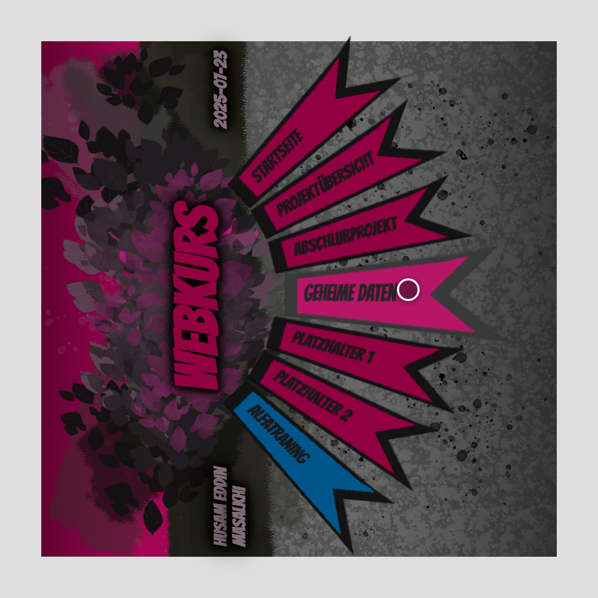

# Interactive Menu Design — Gallery

Dieses Projekt begann als reines Layout in Photoshop: ein Menü, dessen Punkte
nicht brav untereinander stehen, sondern als **gefächerte Comic-Banner** im
Halbkreis liegen. Die Aufgabe war, genau dieses Bild im Browser lebendig zu
machen – ohne den Look zu verwässern und ohne JavaScript.

Herausgekommen ist ein kleines, aber verspieltes CSS-Stück: Sieben Banner werden
einzeln um unterschiedliche Winkel rotiert, überlappen sich zu einem Fächer, und
bekommen über `perspective` + `rotateY` eine echte räumliche Tiefe. Fährt man mit
der Maus darüber, klappt die jeweilige Kachel dem Betrachter entgegen, hellt sich
auf und schiebt ihre Beschriftung nach vorne. Der ganze Effekt ist reine
CSS-Choreografie aus `transform`, `filter` und `transition`.


---

## Das Fächer-Menü  ✅

Jeder Menüpunkt ist ein eigenes Element (`#el1`–`#el7`). Über
`transform: rotate(...)` bekommt jedes einen eigenen Winkel – von −45° ganz oben
bis +45° ganz unten – plus eine feine `top`/`left`-Korrektur, damit die Banner
sauber vom gemeinsamen Drehpunkt am linken Rand ausgehen. So entsteht der
Halbkreis. Sechs Banner sind magenta, das unterste („alfatraining") setzt sich
bewusst blau ab, genau wie in der Vorlage.

Links davon steht der um 270° gedrehte Kopfbereich mit Name, „Webkurs" und Datum,
darüber der große Blätter-/Beton-Hintergrund – zusammen ergibt das den Comic-Look
des Original-PSD.

---

## Die 3D-Hover-Animation  ✅

Das Herzstück. Im Ruhezustand sind die Banner leicht abgedunkelt
(`filter: brightness(0.6)`) und minimal zur Seite gedreht (`rotateY(-5deg)`).
Beim Überfahren passiert alles gleichzeitig und weich (`transition`):

- die Kachel klappt per `rotateY(-35deg)` deutlich auf,
- sie wird heller (`brightness(0.9)`),
- das Banner-Bild skaliert auf und rückt nach vorne,
- die Beschriftung wird größer und wandert nach rechts.

Weil `perspective` auf dem Element liegt, wirkt das Aufklappen tatsächlich
räumlich, nicht wie ein flaches Skalieren.

Der Clip fährt zuerst drei Kacheln einzeln an, damit man das Aufklappen im Detail
sieht, und zieht dann einen geraden vertikalen Strich hoch und runter durch den
Fächer – so triggert eine einzige Bewegung nacheinander jede Kachel:

<video src="https://github.com/TtheProg/interactive-menu-design/raw/main/docs/gallery/menu-hover.mp4" controls autoplay loop muted playsinline width="720"></video>

> Falls das Video nicht abspielt: [menu-hover.mp4](docs/gallery/menu-hover.mp4)

Eine einzelne Kachel im aufgeklappten Zustand, mit dem Mauszeiger darauf:



---

## Sackgassen-Weiterleitung  ✅

Das Projekt ist bewusst nur das **Menü** – die dahinterliegenden Seiten
(Projektübersicht, geheime Daten, Abschlußprojekt, Platzhalter, alfatraining) sind
nicht ausgebaut. Damit trotzdem nichts ins Leere läuft, führen **alle** diese
Menüpunkte auf eine kleine, zentrierte Seite mit 🚧-Symbol und einem Zurück-Button
([`sackgasse.html`](sackgasse.html)) – im gleichen dunklen Magenta-Look wie das
Menü. So bleibt die Live-Version komplett durchklickbar, ohne unfertige oder
unschöne Unterseiten zu zeigen.

---

## Technischer Kern

Das ganze Projekt lebt von wenigen CSS-Zeilen. Der Ausschnitt, der den Fächer
macht:

```css
#el1 { transform: rotate(-45deg); top:  95px; left: 8px; }
#el2 { transform: rotate(-30deg); top:  40px; left: 30px; }
/* ... bis ... */
#el7 { transform: rotate( 45deg); top:-205px; left: 8px; }
```

Und die Hover-Choreografie:

```css
.rot3d        { transform: rotateY(-5deg);  filter: brightness(0.6); transition: transform .2s, filter .2s; }
.rot3d:hover  { transform: rotateY(-35deg); filter: brightness(0.9); }
```

Mehr braucht es nicht – kein JavaScript, kein Framework, kein Build.
