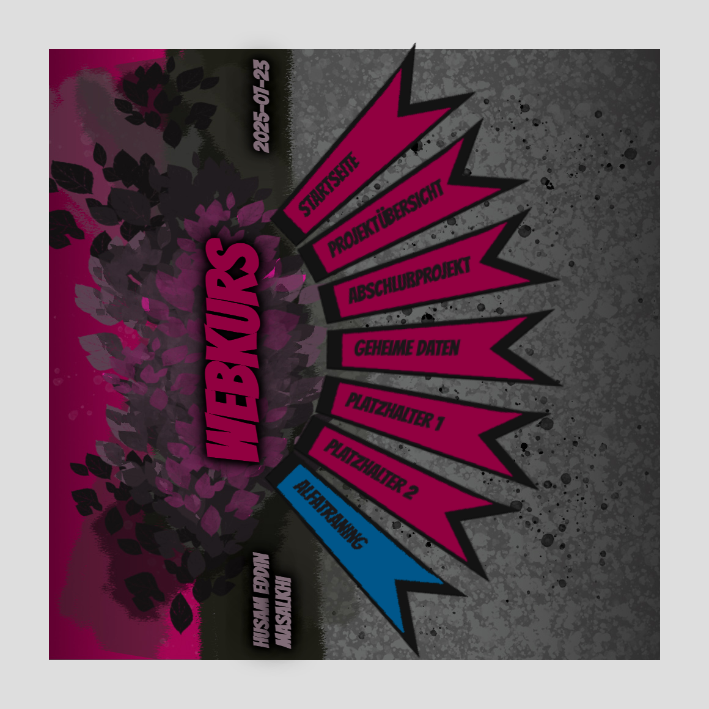

# Interactive Menu Design

Ein reines **HTML- & CSS-Designexperiment**: ein Photoshop-Layout wird 1:1 als
interaktives Web-Menü nachgebaut. Sieben pfeilförmige Menü-Banner liegen im Bogen
gefächert übereinander und klappen beim Überfahren mit der Maus in 3D auf.

Die komplette Fächer-Anordnung, die 3D-Perspektive und die Hover-Animationen
entstehen allein aus CSS-`transform`, `perspective`, `filter` und `transition`.
Vorlage war ein handgezeichnetes PSD-Layout, das im Browser möglichst exakt
reproduziert werden sollte.



Die Maus-Animation in Bewegung:

<video src="https://github.com/TtheProg/interactive-menu-design/raw/main/docs/gallery/menu-hover.mp4" controls autoplay loop muted playsinline width="720"></video>

> Falls das Video oben nicht abspielt: [menu-hover.mp4](docs/gallery/menu-hover.mp4)

## Features

### ✅ Implementiert
- **Fächer-Menü** — sieben Menü-Banner (`#el1`–`#el7`), jedes per `transform:
  rotate(...)` um einen anderen Winkel (−45° bis +45°) gedreht, sodass sie sich zu
  einem Halbkreis-Fächer anordnen.
- **3D-Hover-Animation** — beim Überfahren klappt eine Kachel per `rotateY` zur
  Seite auf, wird aufgehellt (`filter: brightness`), das Banner-Bild skaliert und
  die Beschriftung wächst – alles rein über CSS-`transition`.
- **Vertikaler Kopfbereich** — Name, „Webkurs" und Datum stehen um 270° gedreht am
  linken Rand.
- **Eigene Display-Schrift & Hintergrund** — eingebundene `@font-face`-Schrift
  (Bangers) und ein Blätter-/Beton-Hintergrundbild geben den Comic-Look der
  Vorlage.
- **Sackgassen-Weiterleitung** — alle (noch) nicht implementierten Menüpunkte –
  Projektübersicht, geheime Daten, Abschlußprojekt, die Platzhalter und
  alfatraining – führen auf eine kleine, zentrierte 🚧-Seite
  ([`sackgasse.html`](sackgasse.html)) statt ins Leere. So bleibt das Menü komplett
  durchklickbar, ohne etwas vorzutäuschen.

### 📋 Ausblick
- **Interaktive Live-Version** — das Menü als eigenständiges, öffentliches Projekt
  hostbar machen; interne Links und unfertige Unterseiten sind dafür bereits
  entfernt bzw. auf die Sackgasse umgeleitet.

## Tech-Stack
- **HTML5** – statische Seiten, kein Build-Schritt.
- **CSS3** – `transform` (`rotate`, `rotateY`, `perspective`), `transition`,
  `filter`, `@font-face`. Das ist der eigentliche Kern des Projekts.

Kein JavaScript, keine Frameworks, keine Abhängigkeiten.

## Getting started
Es gibt keinen Build. Weil die Seite relative Pfade und `@font-face` nutzt, sollte
sie über einen kleinen HTTP-Server statt per `file://` geöffnet werden:

```bash
python3 -m http.server 4510
# dann im Browser: http://127.0.0.1:4510/index.html
```

## Gallery
Die vollständige visuelle Tour steht in [Gallery.md](Gallery.md).
